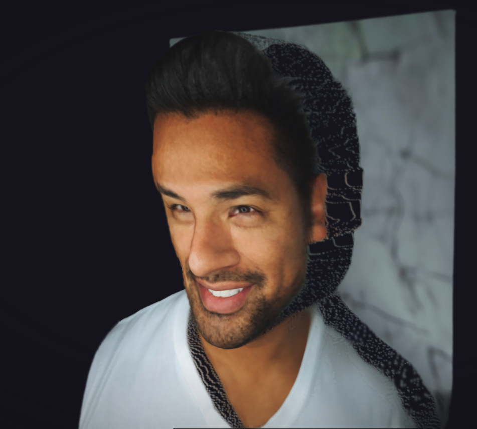

# GazeSplat

**Single-Image 3D Portrait with Real-Time Gaze Tracking**

Upload a selfie. Get an interactive 3D Gaussian Splatting portrait where the subject's eyes follow your cursor in real time.

<p align="center">
  
  &nbsp;&nbsp;&rarr;&nbsp;&nbsp;
  
</p>
<p align="center"><em>A single photo becomes an interactive 3D portrait with gaze tracking, blinks, and micro-expressions.</em></p>

> Sample photo by [Joseph Gonzalez](https://unsplash.com/@itsjosephgonzalez) on [Unsplash](https://unsplash.com).

---

## Quick Start

```bash
npm install && npm run dev
```

Open **http://localhost:5173** in Chrome or Firefox. Upload a front-facing selfie and interact.

For a production build:

```bash
npm run build && npm run preview
```

No server, no API keys, no Docker. Everything runs client-side in the browser.

---

## How It Works

### Pipeline Overview

```
┌──────────┐    ┌────────────────┐    ┌──────────────────┐    ┌─────────────────┐    ┌──────────────┐
│  Upload   │───▶│ Face Detection │───▶│ Depth Estimation │───▶│    Gaussian      │───▶│   WebGL2     │
│  Image    │    │  (MediaPipe)   │    │ (Depth Anything) │    │   Generation     │    │  Rendering   │
└──────────┘    └────────────────┘    └──────────────────┘    └─────────────────┘    └──────────────┘
                   478 landmarks          Per-pixel depth        100K-200K splats       30+ FPS
                   + iris positions       map [0,1]              + eye indices          + gaze tracking
```

### Step 1: Face Detection

[MediaPipe FaceLandmarker](https://ai.google.dev/edge/mediapipe/solutions/vision/face_landmarker) extracts **478 facial landmarks** including 10 iris-specific points (indices 468–477). The system validates that exactly one face is present and rejects ambiguous inputs with a clear error message. Landmark positions are used downstream for eye region identification, inter-pupillary distance computation, and face bounding box extraction.

**Key file:** `src/pipeline/faceDetection.ts`

### Step 2: Monocular Depth Estimation

[Depth Anything V2 Small](https://huggingface.co/depth-anything/Depth-Anything-V2-Small) (~26MB ONNX) runs entirely in the browser via [Transformers.js](https://huggingface.co/docs/transformers.js) on WebGPU (with WASM fallback). It produces a per-pixel relative depth map normalized to [0, 1] where 1.0 = closest to camera. This depth map is the geometric backbone for lifting the 2D image into 3D.

**Key file:** `src/pipeline/depthEstimation.ts`

### Step 3: Gaussian Cloud Generation

The core reconstruction algorithm — a custom depth-map lifting approach:

1. **Downsampling**: The image is scaled to a target resolution (512px) for manageable Gaussian counts.
2. **Adaptive density**: A Sobel gradient filter identifies high-frequency regions (eyes, mouth, hair boundaries). These areas receive 4 Gaussians per pixel; smooth skin regions receive 1. This concentrates detail where it matters most.
3. **3D unprojection**: Each pixel is lifted into 3D space:
   - **XY**: Centered on the face, scaled to a normalized coordinate range.
   - **Z**: Driven by the depth map with 55% face-width displacement — producing pronounced facial relief (nose protrusion, eye socket recession, chin curvature).
4. **Eye tagging**: Iris, eye contour, and upper eyelid Gaussians are identified by proximity to MediaPipe landmark positions. These indices are stored for gaze tracking.
5. **Per-Gaussian properties**: position (xyz), color (sampled from source image), scale (adaptive — thicker Z in face regions, thinner at edges), opacity (0.95 face / 0.5 background), rotation (identity quaternion).

The result: a cloud of 100K–200K 3D Gaussians that faithfully represent the subject's face when viewed within ±40° of frontal.

**Key file:** `src/pipeline/gaussianGenerator.ts`

### Step 4: WebGL2 Splat Rendering

A **custom WebGL2 renderer** implements the full 3D Gaussian Splatting pipeline from scratch — no Three.js or external rendering libraries:

**Data layout**: All Gaussian properties (position, color, scale, rotation, opacity) are stored as RGBA32F textures, enabling efficient GPU-side lookup per instance.

**Vertex shader** (`src/renderer/shaders/splat.vert.glsl`):
- Fetches Gaussian properties from textures using the sorted index
- Constructs the 3D covariance matrix: Σ = R·S·Sᵀ·Rᵀ
- Projects to 2D screen-space covariance via the Jacobian of the perspective projection
- Applies a low-pass filter (0.3px offset) to prevent subpixel flickering
- Computes eigenvalues for the 2D ellipse axes
- Outputs a bounding quad scaled to 3σ of the ellipse

**Fragment shader** (`src/renderer/shaders/splat.frag.glsl`):
- Evaluates Gaussian falloff: α = opacity × exp(−0.5 · r²)
- Discards fragments beyond 3σ
- Outputs premultiplied alpha for front-to-back compositing

**Depth sorting**: A Web Worker (`src/renderer/sorting.worker.ts`) asynchronously sorts Gaussians by view-space depth at ~4–10 Hz. The render loop uses the last-known sort order to avoid blocking the main thread. Sort indices are uploaded as a texture.

**Blending**: `gl.blendFunc(ONE, ONE_MINUS_SRC_ALPHA)` — standard front-to-back alpha compositing with premultiplied alpha.

### Step 5: Real-Time Gaze Tracking

The gaze system operates in 3D — iris Gaussians are physically translated in world space, producing correct parallax when the camera orbits.

**Cursor → angles** (`src/gaze/gazemath.ts`):
- Cursor position is normalized to [−1, 1] relative to canvas center
- Mapped to anatomically-bounded rotation angles: ±35° yaw, ±25° pitch
- Clamped to prevent unnatural eye movement

**Angles → 3D offset**:
- `dx = sin(yaw) × eyeRadius × 1.2` (horizontal iris shift)
- `dy = sin(pitch) × eyeRadius × 1.2` (vertical iris shift)
- `dz = (1 − cos(yaw)) × eyeRadius × 0.3` (subtle depth shift for realism)
- Eye radius estimated from inter-pupillary distance × 0.15

**Smooth interpolation**: Exponential damping with two speeds:
- Tracking speed: 8.0 (snappy cursor follow)
- Return speed: 3.0 (gentle ease-out when cursor leaves the viewport)

**Idle animations** (always active):
- **Micro-saccades**: Layered sine waves produce subtle random eye movements (±0.5°) — the eyes never feel frozen
- **Periodic blinks**: Every 3–6 seconds, a ~150ms blink animates upper eyelid Gaussians downward with smooth quadratic easing and reduces iris opacity
- **Head micro-drift**: Sub-millimeter positional perturbation applied to all Gaussians, simulating involuntary head movement

**Key files:** `src/gaze/gazeController.ts`, `src/gaze/gazemath.ts`

---

## Architecture

```
src/
├── pipeline/                  # One-time reconstruction
│   ├── faceDetection.ts       #   MediaPipe FaceLandmarker (478 landmarks)
│   ├── depthEstimation.ts     #   Depth Anything V2 via Transformers.js
│   ├── gaussianGenerator.ts   #   Depth-to-Gaussian lifting with eye tagging
│   └── processingPipeline.ts  #   Orchestrator with progress callbacks
├── renderer/                  # Real-time rendering
│   ├── SplatRenderer.ts       #   WebGL2 instanced Gaussian renderer
│   ├── camera.ts              #   Orbit camera (azimuth/elevation/zoom)
│   ├── sorting.worker.ts      #   Async depth sorting in Web Worker
│   └── shaders/
│       ├── splat.vert.glsl    #   3D→2D Gaussian projection
│       └── splat.frag.glsl    #   Alpha blending with Gaussian falloff
├── gaze/                      # Eye tracking
│   ├── gazeController.ts      #   Event handling, smooth interpolation, updates
│   └── gazemath.ts            #   Angle math, saccades, blinks, head drift
├── components/                # React UI
│   ├── ImageUpload.tsx        #   Drag-drop, file picker, clipboard, camera
│   ├── ProcessingView.tsx     #   Step-by-step progress animation
│   ├── ViewerCanvas.tsx       #   Canvas, FPS counter, keyboard controls
│   └── ErrorView.tsx          #   Error display with retry
├── utils/                     # Shared helpers
│   ├── mathUtils.ts           #   Clamp, lerp, smooth damp, angle conversion
│   ├── webglUtils.ts          #   Shader compilation, texture creation
│   └── imageUtils.ts          #   Resize, Sobel gradient, ImageData extraction
├── App.tsx                    # State machine: upload → processing → viewing
├── types.ts                   # Shared TypeScript types
└── main.tsx                   # React entry point
```

---

## Design Decisions and Tradeoffs

### 1. Fully Client-Side ML vs. Server-Side GPU

Both MediaPipe and Depth Anything V2 run entirely in the browser (WebGPU with WASM fallback). This eliminates backend infrastructure, keeps user photos private (no server upload), and enables single-command setup (`npm install && npm run dev`). The tradeoff: ~30MB of models must download on first visit (cached by the browser afterward), and inference takes ~10–20s on first run, ~3–5s on subsequent runs. A server-side pipeline would be faster but would require Docker, GPU instances, and API key management.

### 2. Depth-Map Lifting vs. Pretrained Single-Image-to-3DGS Model

Purpose-built models like LGM or SplatterImage produce higher-fidelity multi-view reconstructions but require multi-GB weights and GPU server inference. The depth-map lifting approach runs entirely in-browser, produces recognizable results within ±40° of frontal view, and keeps total download under 30MB. The orbit range is soft-clamped to ±50° to gracefully hide reconstruction artifacts at extreme angles rather than showing broken geometry.

### 3. Custom WebGL2 Renderer vs. Three.js

Writing the splat renderer from scratch — vertex shader Gaussian projection, fragment shader alpha blending, Web Worker depth sorting — demonstrates understanding of the 3DGS rendering pipeline. It also enables direct manipulation of individual Gaussian positions for gaze tracking, which would require custom buffer management in Three.js anyway. The result is a smaller bundle (~50KB vs ~500KB) with full control over every rendering decision.

### 4. 3D Gaze Offsets vs. Texture-Space Gaze

Eye tracking is implemented by physically translating iris Gaussians in 3D space rather than manipulating a 2D texture or billboard. This means the gaze effect exhibits correct parallax when the camera orbits — the eyes genuinely appear to track the cursor in 3D, not just slide across a flat surface. The tradeoff is slightly more per-frame GPU overhead (position texture updates), but the visual improvement in realism is substantial.

### 5. Adaptive Gaussian Density

Rather than placing Gaussians uniformly, a Sobel gradient filter identifies high-frequency regions (edges around eyes, nostrils, lips, hair boundaries) and quadruples the density there. Smooth skin regions keep a single Gaussian per pixel. This produces sharper detail where it matters while keeping total Gaussian count manageable for real-time rendering.

---

## Performance

| Metric | Target | Notes |
|--------|--------|-------|
| Frame rate | ≥ 30 FPS | On 2020-era integrated GPU (Intel Iris or equivalent) |
| Gaussian count | 100K–200K | Varies with image detail and resolution |
| Sort frequency | ~4–10 Hz | Async in Web Worker; render loop never blocks |
| Canvas DPR | Capped at 2× | Prevents excessive fill rate on Retina displays |
| Model download | ~30 MB | One-time; cached by browser for subsequent sessions |
| Reconstruction time | ~10–20s first run | ~3–5s with cached models |

**Bottlenecks**: Depth Anything V2 inference dominates reconstruction time. At render time, the main bottleneck is fragment fill rate (many overlapping semi-transparent Gaussians). The DPR cap and adaptive density help mitigate this.

---

## Interaction

| Input | Action |
|-------|--------|
| **Mouse drag** | Orbit camera (horizontal = azimuth, vertical = elevation) |
| **Scroll wheel** | Zoom in/out |
| **Mouse move** | Eyes track cursor |
| **Mouse leave** | Eyes smoothly return to neutral forward gaze |
| **Touch drag** | Orbit camera (single finger) |
| **Pinch** | Zoom in/out |
| **Arrow keys** | Orbit camera |
| **+/−** | Zoom in/out |
| **R** | Reset camera to default position |

---

## Testing

```bash
npm test          # Run all tests (40 tests across 2 suites)
npm run test:watch  # Watch mode
```

### Test Suites

**`src/__tests__/gazemath.test.ts`** — Gaze tracking mathematics:
- Cursor-to-gaze angle conversion (center, edges, out-of-bounds clamping)
- Smooth interpolation convergence and continuity
- Gaze-to-3D-offset projection with correct scaling
- Micro-saccade generation (bounded amplitude, temporal variation)
- Head drift generation (sub-millimeter scale, non-zero variation)
- Blink factor (periodic cycle, range [0, 1])

**`src/__tests__/gaussianGenerator.test.ts`** — Gaussian cloud generation:
- Non-empty cloud output
- Consistent array sizes (positions, colors, scales, rotations, opacities)
- Finite numeric values (no NaN/Infinity)
- Positive scales, bounded opacity and color values
- Eye region identification (iris, eye contour, eyelid indices)
- Unit quaternion rotations
- Density variation with target resolution

---

## Known Limitations

- **Reconstruction degrades beyond ±40°**. The orbit is soft-clamped at ±50° to prevent showing empty/distorted geometry.
- **Back of head and ears are not reconstructed** — inherent limitation of single frontal-image input.
- **Depth artifacts** on unusual lighting, glasses, heavy makeup, or strong occlusion.
- **Gaze assumes symmetric eye anatomy** — tracking may be slightly off for highly asymmetric faces.
- **First load downloads ~30MB** of ML models. Subsequent visits use the browser cache.
- **No background separation** — the subject and background are reconstructed together.

---

## Future Improvements

Given more time, these are the extensions I would prioritize:

- **Multi-view hallucination**: Generate synthetic side views via Zero-1-to-3 or SV3D to densify occluded regions (ears, hair, neck sides). This would dramatically improve reconstruction at wider angles.
- **Expression mirroring**: Use the device webcam with MediaPipe to estimate the viewer's blendshapes (smile, brow raise, mouth open) and drive the portrait's expression in real time.
- **Relightable splats**: Compute surface normals from depth gradients and implement interactive Lambertian + Fresnel shading so the user can drag a light source around the scene.
- **Progressive rendering**: Display a coarse preview (every 4th Gaussian) immediately while the full cloud loads, refining over 1–2 seconds.
- **WebGPU compute sorting**: Move depth sorting from the Web Worker to a GPU compute shader for 10–50× speedup, enabling per-frame sorting at 60 FPS.
- **Shareable links**: Serialize the Gaussian cloud to a compact binary format, compress it, and encode it in a short URL so recipients can view the portrait with no setup.

---

## Tech Stack

| Technology | Role |
|------------|------|
| **React 19 + TypeScript** | UI framework |
| **Vite 7** | Build tooling and dev server |
| **Tailwind CSS 4** | Utility-first styling |
| **MediaPipe FaceLandmarker** | Face detection + 478-point landmark extraction |
| **Transformers.js + Depth Anything V2 Small** | Client-side monocular depth estimation |
| **WebGL2** | Custom Gaussian splat renderer with instanced rendering |
| **gl-matrix** | Matrix and vector math |
| **Vitest** | Unit testing |

---

## Development

```bash
npm install        # Install dependencies
npm run dev        # Start dev server at localhost:5173
npm run build      # Type-check + production build
npm run preview    # Serve production build locally
npm test           # Run tests
npm run lint       # ESLint check
```

---

## License

MIT
